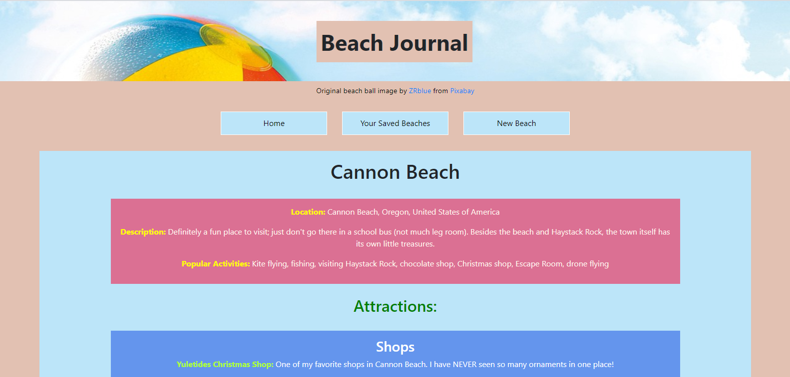

# Beach Journal

  

Welcome to the Beach Journal app! This is my final project for the Flatiron School. It allows users to create and save beaches, as well as write journal entries for those beaches. This repository contains the React/Redux frontend of the project.

## Backend

The backend for the Beach Journal can be found here: [https://github.com/Sdcrouse/beach-journal-backend](https://github.com/Sdcrouse/beach-journal-backend)

## Demo and Blog Post

To view a demo of this app, check out [https://www.loom.com/share/dfdc7f0bdced4f13bc0c6f935c38e892](https://www.loom.com/share/dfdc7f0bdced4f13bc0c6f935c38e892)

To read my blog post for this app, go to [https://www.loom.com/share/dfdc7f0bdced4f13bc0c6f935c38e892](https://www.loom.com/share/dfdc7f0bdced4f13bc0c6f935c38e892)

## Installing and Starting Up the Beach Journal App

Follow these steps to start up the Beach Journal app:

1. Fork and clone this repository onto your own computer and run `cd beach-journal-client`.
2. Navigate to the backend repository and follow the installation instructions, up to and including starting the Rails server.
3. From the `beach-journal-client` directory, run `npm install` and `npm start`.

You're all set to use this app!

## Usage

The Beach Journal app is a single-page application that serves two main purposes: Saving information about your favorite beaches and keeping a journal of your beach trips.

Once the app loads, you can do any of the following:

1. Create a new beach by navigating to the "New Beach" page and filling out the form. 
   * On that form, you can fill out a beach's location and general information.
   * You can also add an attraction with the "Add Attraction" button. Any attractions that you create for a beach will be sorted by their categories.
2. Once you submit the form, you will be redirected to the "Your Saved Beaches" page. Scroll down to the bottom to view your new beach.
   * **Special note:** If this is your first time using the app, you will need to create a new beach before you can write a journal entry for it.
3. Click on the "View Saved Beaches" button to see a list of all of the beaches you've created.
4. On that page, click "View Beach" to check out the information that you've written about a beach.
5. To write a journal entry for a beach, just go to that beach's page, click on the "New Journal Entry" button, and fill out the form.
   * Every journal entry needs a date and text. However, if you want to make your journal entry more like a blog post, you also have the option to give it a title and/or topics.
   * Once you submit the form, you can check out your new journal entry at the bottom of the page.
6. You also have the option of deleting any of your journal entries; just click on its "Delete Journal Entry" button.

## Contributing

Please feel free to raise a new Issue on my repository if you have any problems with my app (installation, usage, bugs, etc), or if you have suggestions for a new feature. Pull requests are also welcome.

Contributors are expected to follow the project's code of conduct. This can be viewed in the [CODE_OF_CONDUCT.md](CODE_OF_CONDUCT.md) file.

## LICENSE

Licensed under the [MIT License](LICENSE).

## Development Notes

This project was bootstrapped with [Create React App](https://github.com/facebook/create-react-app).

In addition to the Node packages provided by Create React App, the following packages were used:
  * [Redux](https://redux.js.org/)
  * [React Redux](https://react-redux.js.org/)
  * [Redux Thunk](https://github.com/reduxjs/redux-thunk)
  * [React Router](https://reactrouter.com/web/guides/quick-start)
  * [React Bootstrap](https://react-bootstrap.github.io/)

## Available Scripts

In the project directory, you can run:

### `npm start`

Runs the app in the development mode. 
Open [http://localhost:3000](http://localhost:3000) to view it in the browser.

The page will reload if you make edits. 
You will also see any lint errors in the console.

### `npm test`

Launches the test runner in the interactive watch mode. 
See the section about [running tests](https://facebook.github.io/create-react-app/docs/running-tests) for more information.

### `npm run build`

Builds the app for production to the `build` folder. 
It correctly bundles React in production mode and optimizes the build for the best performance.

The build is minified and the filenames include the hashes. 
Your app is ready to be deployed!

See the section about [deployment](https://facebook.github.io/create-react-app/docs/deployment) for more information.

### `npm run eject`

**Note: this is a one-way operation. Once you `eject`, you can’t go back!**

If you aren’t satisfied with the build tool and configuration choices, you can `eject` at any time. This command will remove the single build dependency from your project.

Instead, it will copy all the configuration files and the transitive dependencies (webpack, Babel, ESLint, etc) right into your project so you have full control over them. All of the commands except `eject` will still work, but they will point to the copied scripts so you can tweak them. At this point you’re on your own.

You don’t have to ever use `eject`. The curated feature set is suitable for small and middle deployments, and you shouldn’t feel obligated to use this feature. However we understand that this tool wouldn’t be useful if you couldn’t customize it when you are ready for it.

## Learn More

You can learn more in the [Create React App documentation](https://facebook.github.io/create-react-app/docs/getting-started).

To learn React, check out the [React documentation](https://reactjs.org/).

### Code Splitting

This section has moved here: https://facebook.github.io/create-react-app/docs/code-splitting

### Analyzing the Bundle Size

This section has moved here: https://facebook.github.io/create-react-app/docs/analyzing-the-bundle-size

### Making a Progressive Web App

This section has moved here: https://facebook.github.io/create-react-app/docs/making-a-progressive-web-app

### Advanced Configuration

This section has moved here: https://facebook.github.io/create-react-app/docs/advanced-configuration

### Deployment

This section has moved here: https://facebook.github.io/create-react-app/docs/deployment

### `npm run build` fails to minify

This section has moved here: https://facebook.github.io/create-react-app/docs/troubleshooting#npm-run-build-fails-to-minify
